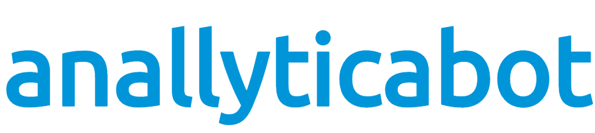

**[Anallyticabot](https://share.streamlit.io/dougtrajano/anallyticabot/anallyticabot.py)** unlock insights from your data to create the right AI-powered conversational experiences.

Anallyticabot is free to use and is an open source project! 💙


# Features

- Counter examples management.
- Decomposition Analysis (2D chart for intents model)
- Intents Discovery
- Examples similarity
- Watson predictions validation

# Installation

## Docker

To run Anallyticabot via Docker, just type

```
docker run --name anallyticabot dougtrajano/anallyticabot
```

## Locally

To run Anallyticabot locally, just type

```
git clone https://github.com/DougTrajano/anallyticabot.git
cd anallyticabot
pip install -r requirements.txt
streamlit run anallyticabot.py
```

# Can I see a demo?

[](https://share.streamlit.io/dougtrajano/anallyticabot/anallyticabot.py)

# License

See [LICENSE](LICENSE) for details.